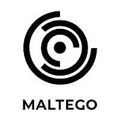
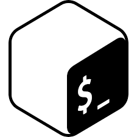

<h2 align="center"> Hola, Hello, Salut, Ciao, Hallo! </h2>

<!--##############################################################################################################################################################################-->

- 🔐 Passionate about cybersecurity, tech gadgets/components, and languages 
- 🎓 Currently working on attaining my RNCP-accredited diploma in Computer Science at 42 London 
- 🌐 Learning Networking and Cybersecurity through the CISCO Academy — and German on Duolingo 🇩🇪 
- 💻 Recently built a C program that recreates `printf` — [Check it out here](https://github.com/aramos-gua/printf)
 
 

<!--##############################################################################################################################################################################-->

<strong>Stats</strong>

  <!-- Streak stat card (larger middle) -->
  

  
   

  <!-- Languages used stat card -->
  

<!--##############################################################################################################################################################################-->

  
<strong>Programming Languages</strong>

  

    <a href="https://github.com/aramos-gua">
    <code></code>
    </a>
  

  
<strong>Operating Systems</strong>

  

    <a href="https://github.com/aramos-gua">
    <code></code>
    <code></code>
    <code></code>
    <code></code>
    <a>  

  
<strong>Text Editors & IDEs</strong>

  

    <a href="https://github.com/aramos-gua">
    <code></code>
    <code></code>
    <code></code>
    <code></code>
    </a>
  

  
<strong>Cybersecurity</strong>

  

    <a href="https://github.com/aramos-gua">
    <code></code>
    <code></code>
    
    
    
    
    </a>
  

<!--
**Alejandro-Ramos-42/Alejandro-Ramos-42** is a ✨ _special_ ✨ repository because its `README.md` (this file) appears on your GitHub profile.

Here are some ideas to get you started:

- 🔭 I’m currently working on ...
- 🌱 I’m currently learning ...
- 👯 I’m looking to collaborate on ...
- 🤔 I’m looking for help with ...
- 💬 Ask me about ...
- 📫 How to reach me: ...
- 😄 Pronouns: ...
- ⚡ Fun fact: ...
-->
