<h2 align="center"> Hola, Hello, Salut, Ciao, Hallo! </h2>

<!--##############################################################################################################################################################################-->

- 🔐 Passionate about cybersecurity, tech gadgets/components, and languages 
- 🎓 Currently working on attaining my RNCP-accredited diploma in Computer Science at 42 London 
- 🌐 Learning Cybersecurity through TryHackMe and HackTheBox — and German on Duolingo 🇩🇪 
- 💻 Recently built a C program that recreates the pipes behaviour in the terminal — [Check it out here](https://github.com/aramos-gua/pipex)
 
 

<!--##############################################################################################################################################################################-->

<strong>Stats</strong>

  <!-- Streak stat card (larger middle) -->
  

 

  <!-- Languages used stat card -->
  <!--

 -->

<!--##############################################################################################################################################################################-->

  
<strong>Certifications</strong>

  

    <a href="https://cp.certmetrics.com/comptia/en/public/verify/credential/8EV34FTS8M4Q2VJJ">
    <code>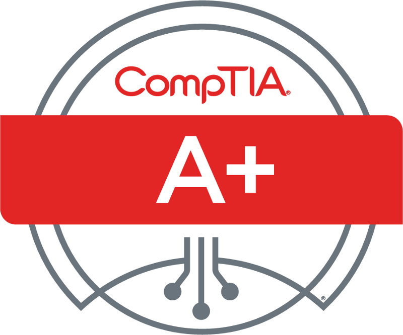</code>
    </a>
    <a href="https://www.credly.com/badges/db511bcc-331f-4def-8e64-ae429f666230/public_url">
    <code>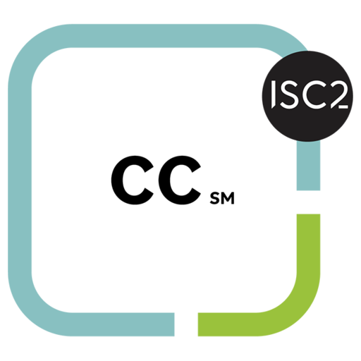</code>
    </a>
	<a href="https://github.com/aramos-gua">
    <code></code>
    </a>
	<a href="https://cp.certmetrics.com/comptia/en/public/verify/credential/2070d6bd4d1e470c9b5f2d67e3e4da26">
    <code></code>
    </a>
  

  
<strong>Programming Languages</strong>

  

    <a href="https://github.com/aramos-gua">
    <code></code>
    </a>
  

  
<strong>Projects</strong>

  

    <a href="https://github.com/aramos-gua/libft">
    <code></code>
    </a>
	<a href="https://github.com/aramos-gua/born2beroot">
    <code></code>
    </a>
	<a href="https://github.com/aramos-gua/printf">
    <code>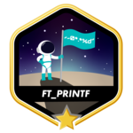</code>
    </a>
	</a>
	<a href="https://github.com/aramos-gua/get_next_line">
    <code></code>
    </a>
	</a>
	<a href="https://github.com/aramos-gua/push_swap">
    <code></code>
    </a>
	</a>
	<a href="https://github.com/aramos-gua/fdf">
    <code></code>
    </a>
	</a> 
	<a href="https://github.com/aramos-gua/pipex">
    <code>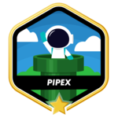</code>
    </a>
	</a>
	<a href="https://github.com/aramos-gua/philosophers">
    <code></code>
    </a>
	</a>
	<a href="https://github.com/aramos-gua/minishell">
    <code>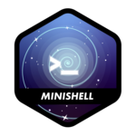</code>
    </a>
	<a href="https://github.com/aramos-gua/net_practice">
    <code></code>
    </a>
	<a href="https://github.com/aramos-gua/miniRT">
    <code>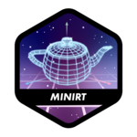</code>
    </a>
	</a>

  
<strong>Operating Systems</strong>

  

    <a href="https://github.com/aramos-gua">
    <code></code>
    <code></code>
    <code></code>
    <code></code>
    <a>  

  
<strong>Text Editors & IDEs</strong>

  

    <a href="https://github.com/aramos-gua">
    <code></code>
    <code></code>
    <code></code>
    <code></code>
    </a>
  

  
<strong>Cybersecurity</strong>

  

	  <a href="https://tryhackme.com/p/aramos.gua">
	    
	    
    <a href="https://github.com/aramos-gua">
    <code>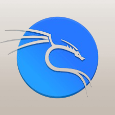</code>
    <code>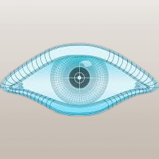</code>
    <code>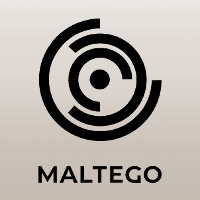</code>
	<code>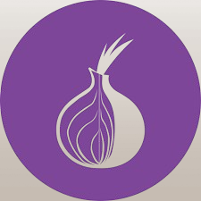</code>
	<code></code>
	<code>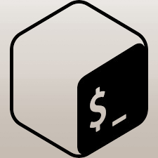</code>
    </a>
		  
  

